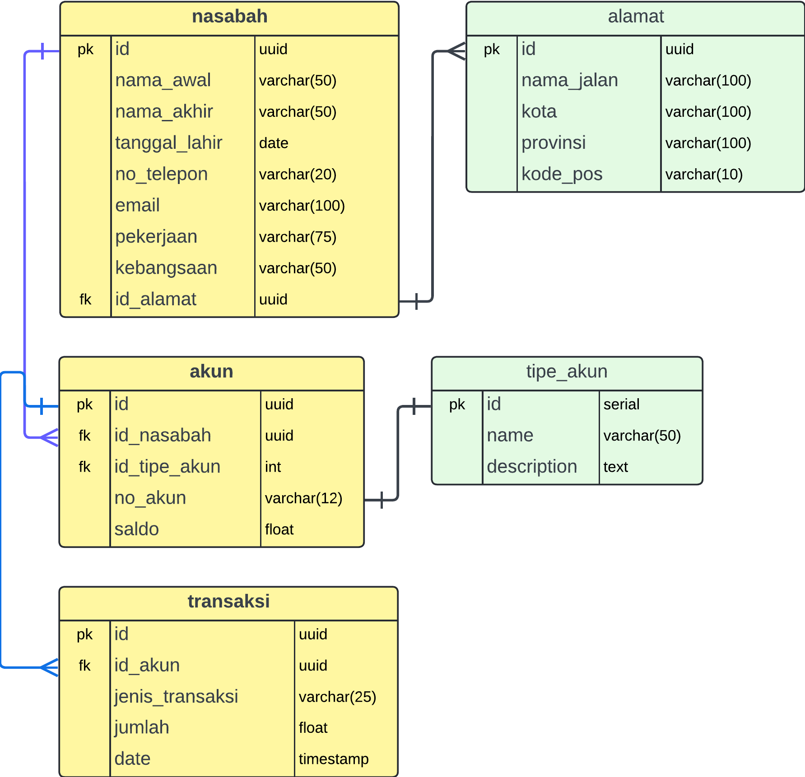

# Binar Backend JavaScript Bootcamp- Challenge Chapter 3

Ini merupakan salah satu Challenge Chapter 3 untuk program Bootcamp Binar Backend JavaScript

## Membuat Entity Relationship Diagram (ERD) untuk sebuah program perbank-an sederhana yang memiliki tiga entitas antara lain :
-   Alamat
-   Nasabah
-   Akun
-   Jenis Akun
-   Transaksi

## Dimana setiap entitas memilki relasi antara lain :
-   Satu Nasabah dapat memiliki beberapa Alamat, tetapi setiap Alamat hanya dimiliki oleh satu Nasabah
-   Satu Nasabah dapat memiliki beberapa Akun, tetapi setiap Akun hanya dimiliki oleh satu Nasabah
-   Satu Akun hanya dapat memiliki satu Jenis Akun, begitu juga sebaliknya
-   Satu Akun dapat memiliki banyak Transaksi, tetapi setiap Transaksi hanya terkait dengan satu Akun.

